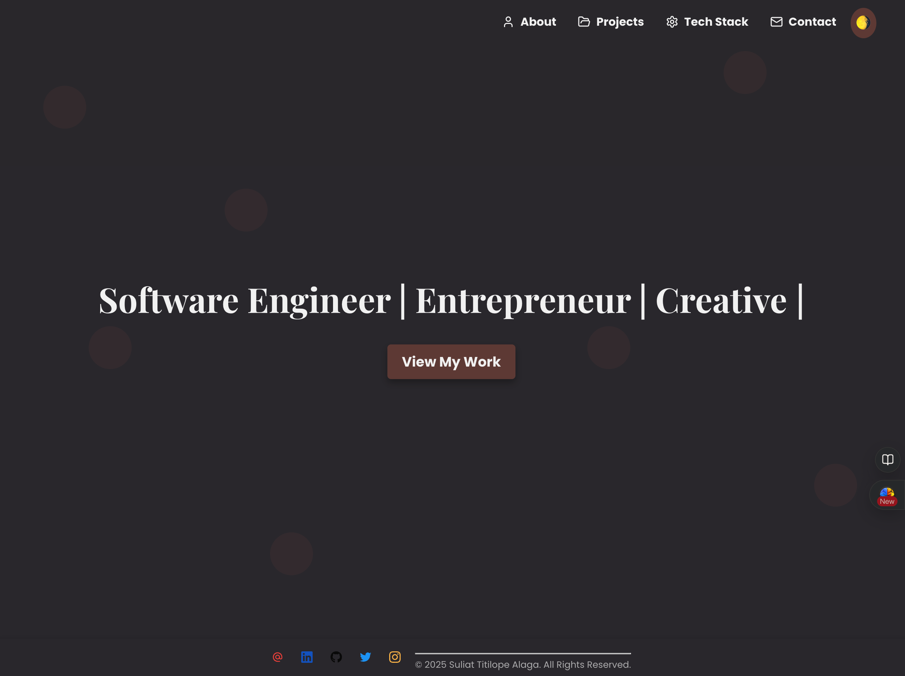
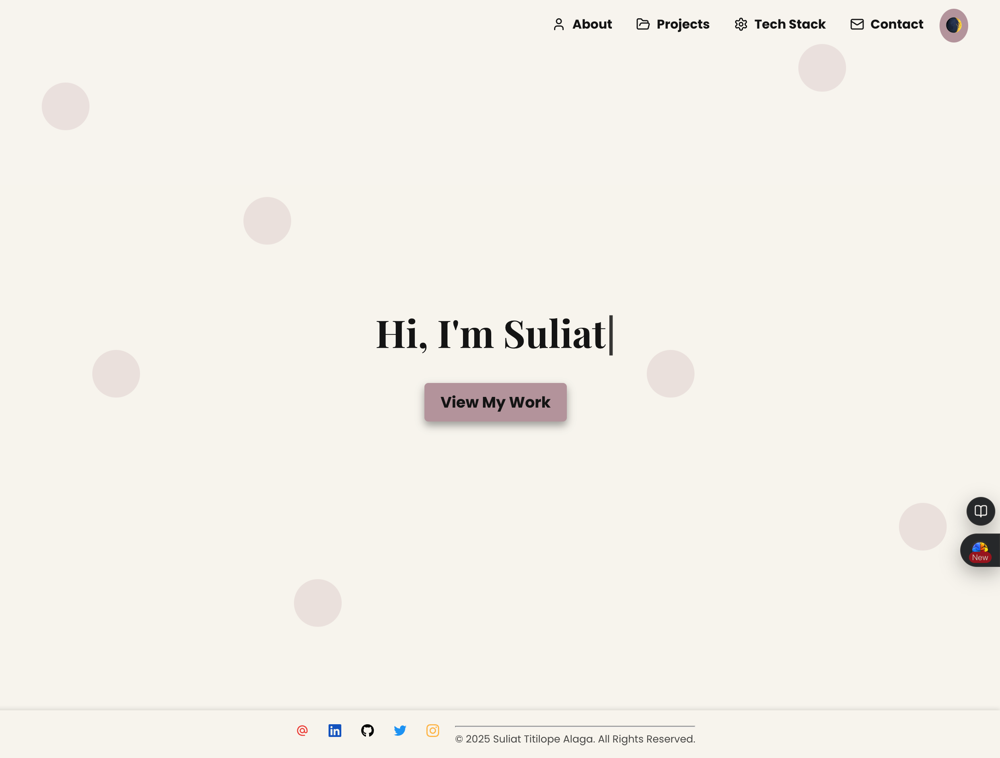

# My Portfolio

An elegant, responsive, and modern portfolio built with **React**, **TypeScript**, **Styled-Components**, **Framer Motion**, **Firebase**, and **EmailJS**. This project showcases a **Hero Section**, **About Section**, **Contact Section** (with map), **Dark Mode**, **Toast notifications**, and more.





---

## Table of Contents

1. [Features](#features)
2. [Tech Stack](#tech-stack)
3. [Getting Started](#getting-started)
4. [Project Structure](#project-structure)
5. [Scripts](#scripts)
6. [Firebase Integration](#firebase-integration)
7. [Toast Component](#toast-component)
8. [EmailJS Integration](#emailjs-integration)
9. [Dark Mode](#dark-mode)
10. [Deployment on Vercel](#deployment-on-vercel)
11. [License](#license)

---

## Features

- **Responsive Design**: Looks great on desktop, tablet, and mobile.
- **Hero Section**: Animated introduction with a call-to-action button.
- **About Section**: A layout with images and subtle animations using Framer Motion.
- **TechStack Section**: Highlighted the technologies used with cool animations.
- **Projects Section**:
  - Fetches projects from **Firebase** (Firestore).
  - Displays them in a sleek grid.
  - Uses a **Toast** notification on success or error.
- **Contact Section**: Contact form integrated with EmailJS + a live Google Map.
- **Dark Mode**: Toggle between light and dark themes effortlessly.
- **Framer Motion Animations**: Smooth transitions and interactive elements.
- **Styled Components**: CSS-in-JS with theme support for easy design changes.

---

## Tech Stack

- **React + TypeScript**: Core framework and static typing.
- **Styled-Components**: Modular and dynamic styling.
- **Framer Motion**: Declarative animations and scroll-based effects.
- **Firebase (Firestore)**: Real-time database for storing and fetching projects.
- **EmailJS**: Client-side email sending (no backend required).
- **Vercel**: Deployment and hosting.

---

## Getting Started

### 1. Clone the Repository

```bash
git clone https://github.com/lope1999/my-portfolio.git
cd my-portfolio
```

### 2. Install Dependencies

```bash
npm install
```

or

```bash
yarn
```

### 3. Set Up Environment Variables

If you have environment variables (e.g., Firebase config, EmailJS keys), create a `.env` file in the root directory:

```
REACT_APP_FIREBASE_API_KEY=xxx
REACT_APP_FIREBASE_AUTH_DOMAIN=xxx
REACT_APP_FIREBASE_PROJECT_ID=xxx
REACT_APP_EMAILJS_SERVICE_ID=xxx
REACT_APP_EMAILJS_TEMPLATE_ID=xxx
REACT_APP_EMAILJS_PUBLIC_KEY=xxx
```

> Make sure to add `.env` to your `.gitignore` to avoid committing secrets.

### 4. Run the Development Server

```bash
npm start
```

or

```bash
yarn start
```

Then visit [http://localhost:3000](http://localhost:3000) to view your portfolio in the browser.

---

## Project Structure

```
my-portfolio
├─ public
│   ├─ darkmode_desktop.png
│   ├─ darkmode_mobile.png
│   ├─ lightmode_desktop.png
│   ├─ lightmode_mobile.png
│   └─ index.html
├─ src
│   ├─ components
│   │   ├─ HeroSection.tsx
│   │   ├─ ThemeToggle.tsx
│   │   ├─ Toast.tsx
│   │   ├─ ProjectsGrid.tsx
│   │   └─ ...
│   ├─ pages
│   │   ├─ AboutSection.tsx
│   │   ├─ ProjectsSection.tsx
│   │   └─ ContactSection.tsx
│   ├─ context
│   │   └─ ThemeContext.tsx
│   ├─ utils
│   │   ├─ firebase.ts
│   │   └─ utils.ts
│   ├─ App.tsx
│   ├─ index.tsx
│   └─ theme.ts
├─ package.json
├─ README.md
└─ tsconfig.json
```

- **`components/`**: Reusable components (Hero, Toast, ThemeToggle, ProjectsGrid, etc.).
- **`pages/`**: Main sections (About, Projects, Contact).
- **`context/`**: Theme context for dark/light mode.
- **`utils/`**: Firebase config, helper functions, etc.
- **`theme.ts`**: Light and dark theme objects.

---

## Scripts

In your `package.json`, you’ll typically have:

```json
{
  "scripts": {
    "start": "react-scripts start",
    "build": "react-scripts build",
    "test": "react-scripts test",
    "eject": "react-scripts eject"
  }
}
```

|  Script | Description                                |
| ------: | :----------------------------------------- |
| `start` | Runs the app in development mode           |
| `build` | Builds the app for production              |
|  `test` | Launches the test runner                   |
| `eject` | Ejects the configuration (not recommended) |

> **Note**: If you’re using **Vite**, your scripts will differ:
>
> ```json
> {
>   "scripts": {
>     "dev": "vite",
>     "build": "vite build",
>     "preview": "vite preview"
>   }
> }
> ```

---

## Firebase Integration

1. **Install Firebase**:

   ```bash
   npm install firebase
   ```

   or

   ```bash
   yarn add firebase
   ```

2. **Configure Firestore** (in `src/utils/firebase.ts`):

   ```ts
   import { initializeApp } from "firebase/app";
   import { getFirestore } from "firebase/firestore";

   const firebaseConfig = {
     apiKey: process.env.REACT_APP_FIREBASE_API_KEY,
     authDomain: process.env.REACT_APP_FIREBASE_AUTH_DOMAIN,
     projectId: process.env.REACT_APP_FIREBASE_PROJECT_ID,
     // ... other fields as needed
   };

   const app = initializeApp(firebaseConfig);
   export const db = getFirestore(app);
   ```

3. **Fetch Data** (e.g., in `ProjectsSection.tsx`):

   ```ts
   import { collection, getDocs } from "firebase/firestore";
   import { db } from "../utils/firebase";

   useEffect(() => {
     const fetchProjects = async () => {
       try {
         const querySnapshot = await getDocs(collection(db, "portfolio"));
         const data = querySnapshot.docs.map((doc) => doc.data());
         setProjects(data);
       } catch (error) {
         console.error("Error fetching projects:", error);
       }
     };
     fetchProjects();
   }, []);
   ```

4. **Security Rules**: Configure your Firestore rules if you want to restrict or allow certain reads/writes.

---

## Toast Component

We use a **Toast** component to show **success** or **error** messages—especially handy after fetching data from Firebase. It includes:

- **Type variants** (`success`, `info`, `error`, `warning`).
- **Icons** to differentiate messages.
- **Auto-close** after a specified duration.
- **Progress bar** to visualize time remaining.

**Example** (`src/components/Toast.tsx`):

```tsx
import React, { useEffect } from "react";
import styled, { keyframes } from "styled-components";
import { motion, AnimatePresence } from "framer-motion";

type ToastType = "success" | "info" | "error" | "warning";

interface ToastProps {
  type?: ToastType;
  message: string;
  isVisible: boolean;
  onClose: () => void;
  duration?: number;
}

// ... styles + keyframes ...

const Toast: React.FC<ToastProps> = ({
  type = "info",
  message,
  isVisible,
  onClose,
  duration = 3000,
}) => {
  // Auto-close logic
  useEffect(() => {
    if (isVisible) {
      const timer = setTimeout(onClose, duration);
      return () => clearTimeout(timer);
    }
  }, [isVisible, duration, onClose]);

  return (
    <AnimatePresence>
      {isVisible && (
        <StyledToastWrapper /* ...motion variants... */>
          {/* Toast content + progress bar */}
        </StyledToastWrapper>
      )}
    </AnimatePresence>
  );
};

export default Toast;
```

Then **use** it in your component:

```tsx
import Toast from "./Toast";

const [toastVisible, setToastVisible] = useState(false);
const [toastMessage, setToastMessage] = useState("");
const [toastType, setToastType] = useState<
  "success" | "error" | "info" | "warning"
>("info");

// Show success
setToastType("success");
setToastMessage("Projects fetched successfully!");
setToastVisible(true);
```

---

## EmailJS Integration

1. **Create an Account**: Sign up at [EmailJS](https://www.emailjs.com/).
2. **Configure**: Create an email service (Gmail, SMTP, etc.) and a template.
3. **Add Credentials**: In your `.env` or directly in code, define `SERVICE_ID`, `TEMPLATE_ID`, and `PUBLIC_KEY`.
4. **Form Fields**: Ensure your input names match your EmailJS template variables.

**Example** (`ContactSection.tsx`):

```tsx
import emailjs from "emailjs-com";

const handleSubmit = (e: React.FormEvent) => {
  e.preventDefault();
  emailjs
    .sendForm(
      process.env.REACT_APP_EMAILJS_SERVICE_ID!,
      process.env.REACT_APP_EMAILJS_TEMPLATE_ID!,
      formRef.current!,
      process.env.REACT_APP_EMAILJS_PUBLIC_KEY!
    )
    .then(
      () =>
        setToast({ message: "Message sent!", type: "success", visible: true }),
      () =>
        setToast({
          message: "Error, please try again.",
          type: "error",
          visible: true,
        })
    );
};
```

---

## Dark Mode

- **ThemeContext**: A `ThemeContext` toggles between **light** and **dark** themes.
- **GlobalStyles**: Dynamically reads from the context to style `body`, `background`, and `text`.
- **Toggle Button**: A button in `ThemeToggle.tsx` calls `toggleTheme()` from the context.

```ts
// theme.ts
export const lightTheme = {
  background: "#f9f6f1",
  text: "#1a1a1a",
  accent: "#8b5e3c",
};

export const darkTheme = {
  background: "#1a1a1a",
  text: "#f4f4f4",
  accent: "#d2a679",
};
```

---

## Deployment on Vercel

1. **Create a Vercel Account**: [https://vercel.com](https://vercel.com)
2. **Connect Git Repository**: Vercel will import your repo and detect `create-react-app` or `vite` automatically.
3. **Build & Output Settings**:
   - **Build Command**: `npm run build`
   - **Output Directory**: `build` (or `dist` if Vite)
4. **Environment Variables**: Add your Firebase & EmailJS keys in **Project Settings** → **Environment Variables**.
5. **Deploy**: Click **Deploy**. Your site will be live at something like `https://my-portfolio-suliat.vercel.app/`.

---

## License

This project is open-source (MIT License). Feel free to modify and distribute as you like.
See the [LICENSE](LICENSE) file for more details.

---

### Author

**Suliat Titilope Alaga**
_Be Obsessed with Growth!_

Enjoy your new portfolio! If you have any questions or run into issues, feel free to reach out;
💌 alagasuliattitilope@email.com.

_Happy coding and showcasing your brand!_

```

---

```

```

```
