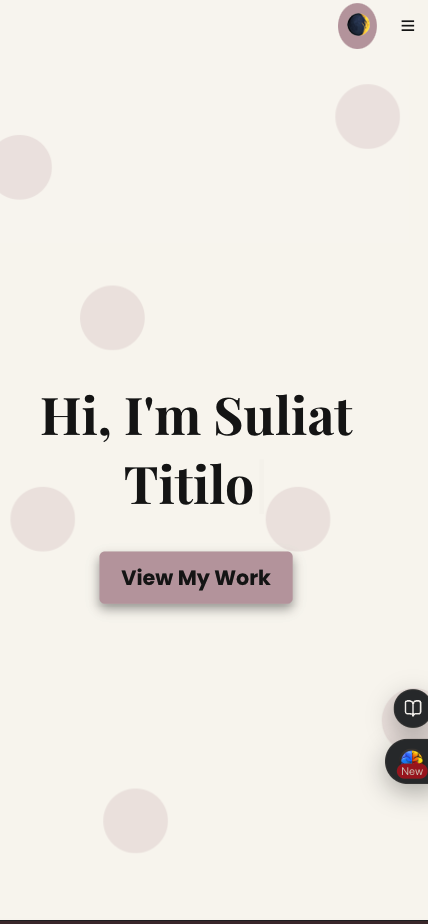

# My Portfolio

An elegant, responsive, and modern portfolio built with **React**, **TypeScript**, **Styled-Components**, **Framer Motion**, and **EmailJS**. This project showcases a **Hero Section**, **About Section**, **Contact Section** (with map), **Dark Mode**, and more.




## Table of Contents

1. [Features](#features)
2. [Tech Stack](#tech-stack)
3. [Getting Started](#getting-started)
4. [Project Structure](#project-structure)
5. [Scripts](#scripts)
6. [EmailJS Integration](#emailjs-integration)
7. [Dark Mode](#dark-mode)
8. [Deployment on Vercel](#deployment-on-vercel)
9. [License](#license)

---

## Features

- **Responsive Design**: Looks great on desktop, tablet, and mobile.
- **Hero Section**: Animated introduction with a call-to-action button.
- **About Section**: A layout with an image displayed with parallax and fade-in effects using Framer Motion.
- **TechStack Section**: Highlighted the technologies I use with cool animations.
- **Projects Section**: A sleek grid showcasing my best work.
- **Contact Section**: Contact form integrated with EmailJS + a live Google Map.
- **Dark Mode**: Toggle between light and dark themes effortlessly.
- **Framer Motion Animations**: Smooth transitions and interactive elements.
- **Styled Components**: CSS-in-JS with theme support for easy design changes.

---

## Tech Stack

- **React + TypeScript**: Core framework and static typing.
- **Styled-Components**: Modular and dynamic styling.
- **Framer Motion**: Declarative animations and scroll-based effects.
- **EmailJS**: Client-side email sending (no backend required).
- **Google Maps Embed**: Display a live map next to the contact form.
- **Vercel**: Deployment and hosting.

---

## Getting Started

### 1. Clone the Repository

```bash
git clone https://github.com/your-username/my-portfolio.git
cd my-portfolio
```

### 2. Install Dependencies

```bash
npm install
```

or

```bash
yarn
```

### 3. Set Up Environment Variables (Optional)

If you have any environment variables (e.g., for EmailJS keys), create a `.env` file in the root directory:

```
REACT_APP_EMAILJS_SERVICE_ID=your_service_id
REACT_APP_EMAILJS_TEMPLATE_ID=your_template_id
REACT_APP_EMAILJS_PUBLIC_KEY=your_public_key
```

> Make sure to add `.env` to your `.gitignore` to avoid committing secrets.

### 4. Run the Development Server

```bash
npm start
```

or

```bash
yarn start
```

Then visit [http://localhost:3000](http://localhost:3000) to view your portfolio in the browser.

---

## Project Structure

```
my-portfolio
├─ public
│  ├─ darkmode_desktop.png
│  ├─ darkmode_desktop.png
│  ├─ darkmode_desktop.png
│  ├─ darkmode_desktop.png
│  └─ index.html
├─ src
│  ├─ components
│  │  ├─ HeroSection.tsx
│  │  ├─ Button.tsx
│  │  └─ ThemeToggle.tsx
│  ├─ pages
│  │  ├─ AboutSection.tsx
│  │  └─ ContactSection.tsx
│  ├─ context
│  │  └─ ThemeContext.tsx
│  ├─ styles
│  │  └─ GlobalStyles.ts
│  ├─ utils
│  │  └─ utils.tsx
│  ├─ App.tsx
│  ├─ index.tsx
│  └─ theme.ts
├─ package.json
├─ README.md
└─ tsconfig.json
```

- **`components/`**: Reusable components (Hero, Button, ThemeToggle, etc.).
- **`pages/`**: Main sections (About, Contact).
- **`context/`**: Theme context for dark/light mode.
- **`styles/`**: Global styles, shared mixins, etc.
- **`utils/`**: Utility functions, custom hooks, or constants.
- **`theme.ts`**: Light and dark theme objects.

---

## Scripts

In your `package.json`, you’ll typically have:

```json
{
  "scripts": {
    "start": "react-scripts start",
    "build": "react-scripts build",
    "test": "react-scripts test",
    "eject": "react-scripts eject"
  }
}
```

|  Script | Description                                |
| ------: | :----------------------------------------- |
| `start` | Runs the app in development mode           |
| `build` | Builds the app for production              |
|  `test` | Launches the test runner                   |
| `eject` | Ejects the configuration (not recommended) |

> **Note**: If you’re using **Vite**, your scripts will differ:
>
> ```json
> {
>   "scripts": {
>     "dev": "vite",
>     "build": "vite build",
>     "preview": "vite preview"
>   }
> }
> ```

---

## EmailJS Integration

1. **Create an Account**: Sign up at [EmailJS](https://www.emailjs.com/).
2. **Configure**: Create an email service (Gmail, SMTP, etc.) and a template.
3. **Add Credentials**: In `ContactSection.tsx`, replace placeholders with your actual `SERVICE_ID`, `TEMPLATE_ID`, and `PUBLIC_KEY`.
4. **Form Fields**: Make sure the `name` attributes in your inputs match your EmailJS template variables (e.g., `name="from_name"`, `name="email"`, `name="message"`).

```tsx
import emailjs from "emailjs-com";

const handleSubmit = (e: React.FormEvent) => {
  e.preventDefault();
  if (!formRef.current) return;

  emailjs
    .sendForm(
      process.env.REACT_APP_EMAILJS_SERVICE_ID || "service_xxx",
      process.env.REACT_APP_EMAILJS_TEMPLATE_ID || "template_xxx",
      formRef.current,
      process.env.REACT_APP_EMAILJS_PUBLIC_KEY || "publicKey_xxx"
    )
    .then(
      (result) => alert("Your message has been sent!"),
      (error) => alert("An error occurred, please try again.")
    );
};
```

---

## Dark Mode

- **ThemeContext**: I used a `ThemeContext` to toggle between light and dark themes.
- **GlobalStyles**: Dynamically reads from `theme` to style `body`, `background`, and `text`.
- **Toggle Button**: A button in `ThemeToggle.tsx` calls `toggleTheme()` from the context.

```tsx
// Light and Dark theme objects
export const lightTheme = {
  background: "#f9f6f1",
  text: "#1a1a1a",
  accent: "#8b5e3c",
};

export const darkTheme = {
  background: "#1a1a1a",
  text: "#f4f4f4",
  accent: "#d2a679",
};
```

---

## Deployment on Vercel

1. **Create a Vercel Account**: [https://vercel.com](https://vercel.com)
2. **Connect Git Repository**: Vercel will import your repo and detect `create-react-app` or `vite` automatically.
3. **Build & Output Settings**:
   - For **Create React App**:
     - **Build Command**: `npm run build`
     - **Output Directory**: `build`
   - For **Vite**:
     - **Build Command**: `npm run build`
     - **Output Directory**: `dist`
4. **Environment Variables**: Add your EmailJS keys in **Project Settings** → **Environment Variables**.
5. **Deploy**: Click **Deploy**. Your site will be live at something like `https://my-portfolio.vercel.app`.

---

## License

This project is open-source (MIT License). Feel free to modify and distribute as you like.  
See the [LICENSE](LICENSE) file for more details.

---

### Author

**Suliat Titilope Alaga**  
_Be Obsessed with Growth!_

Enjoy your new portfolio! If you have any questions or run into issues, feel free to reach out.

---

_Happy coding and showcasing your brand!_
